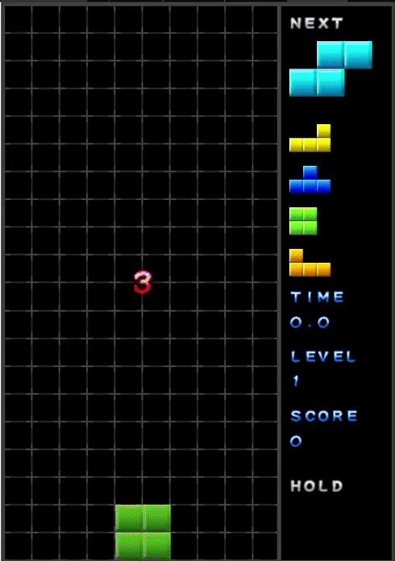

# JStetris
Cohesive Tetris clone with sound effects, ghost preview, results and multiple game modes. You can customize block styles, configure DAS, ARR, lock delay and lock resets. [Play Online!](https://pregmati.github.io/JStetris)

  

## Controls
* Use right and left or A and D to move left and right
* Up or W or X to rotate clockwise
* Ctrl or Z to rotate anti-clockwise
* Space to hard drop
* Down arrow or S for soft drop
* Shift or C for hold

## Game modes
* Marathon: Standard Tetris mode of increasingly fast levels. You level up for every 10 lines cleared. Custom speed curve. 
* Sprint: Race to clear a certain number of lines, by default 40.
* Ultra: Time limited game mode, enter the time you will play for and challenge yourself to clear as many lines as possible.

## Settings
* Adjust the games aesthetics by changing style in the dropdown.
* Turn music, sound effects, ghost preview and line clear screen shake on or off.
* Change technical input handling details, including DAS, ARR, Lock delay time and Max lock resets.

